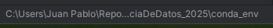
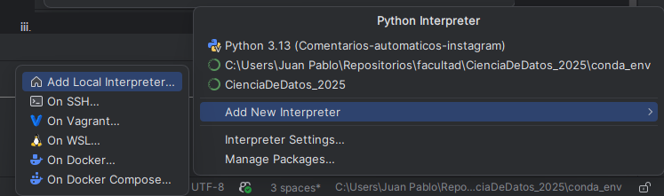
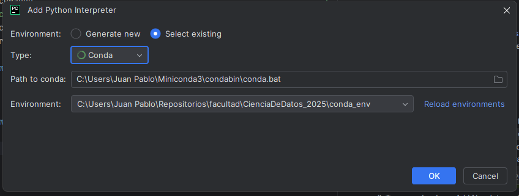

# CienciaDeDatos_2025
# Como instalar el entorno
## Descargar Miniconda
1. Descargar miniconda del sitio oficial: https://www.anaconda.com/
2. Instalar miniconda con las opciones por defecto del instalador.

## Crear el entorno
1. Clonar el repositorio
2. Abrir Anaconda Prompt desde el buscador de windows
3. Ejecutar:

   `cd C:\<ruta-donde-hayas-clonado-el-repo>\CienciaDeDatos_2025`

   `conda create --prefix ./conda_env python=3.12`

   El conda_env deberia crearse en la carpeta raiz del repositorio

4. Ejecutar el siguiente comando:

   `conda create --prefix ./conda_env python=3.12`

5. Crear interprete en pycharm (ahi lo hice yo)
   1. En la parte inferior derecha veras para seleccionar interprete 
   
   

   2. Tocar y seleccionar Add New Interpreter y Add Local Interpreter
   
   

   3. Seleccionar Existing environment. Deberian completarse automaticamente los campos.
   
    

6. OPCIONAL si usas vs code con Copilot:
   El entorno se activa asi (reemplazar lo que sea conveniente):
   $ conda activate "DISCO:\carpetas\CienciaDeDatos_2025\conda_env"

En el archivo utils/requirements.txt estan las librerias que se instalan aparte de las que trae el conda_env al crearse. 
Si en tu rama creas instalas alguna libreria extra, agregalo para llevar seguimiento de las librerias que se requueriran al mergear al main